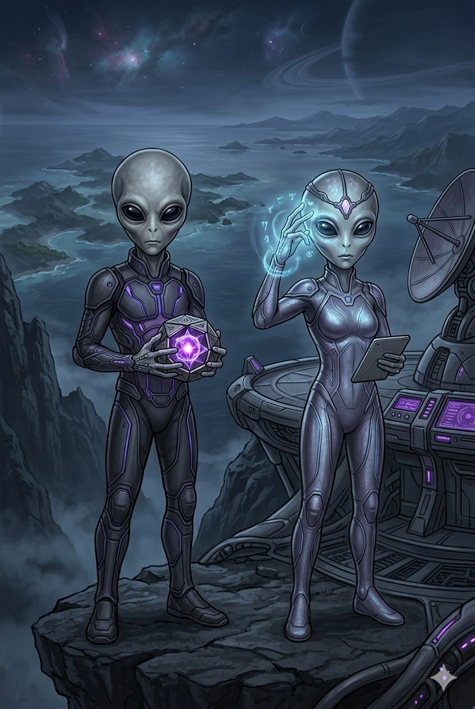

# As Raças do Arquipélago

## A Influência da Raça no Jogo

Em A Cúpula, a escolha da sua raça não prende você a modificadores numéricos de atributos ou limitações de classe. Um Orc pode ser um Mago brilhante e uma Fada pode ser uma Bárbaro letal. A sua raça dita exclusivamente duas coisas vitais para o seu personagem: a sua **Aparência** e as suas **Habilidades Inatas (Slots 7 e 8)**.

### Liberdade Estética e Aparência
A aparência principal da raça dita os traços fundamentais do seu mercenário (como as escamas de um Draconato ou os olhos profundos de um Greylin), mas a customização é inteiramente livre. Cor de pele, estilo e cor de cabelo, formato dos olhos, marcas de nascença, cicatrizes e o porte físico (seja um Elfo absurdamente musculoso ou um Orc esguio) ficam totalmente a critério da sua imaginação. Você tem liberdade absoluta para desenhar o personagem da forma que quiser, desde que a biologia central da raça seja respeitada.

### As Habilidades Inatas (Slots 7 e 8)
A biologia e a herança cultural da sua raça fornecem talentos únicos que outras espécies não conseguem replicar. Cada raça possui uma lista própria de Habilidades Inatas exclusivas. Durante a preparação para a batalha, você poderá escolher duas dessas habilidades para preencher obrigatoriamente os seus **Slots 7 e 8** no seu *loadout* de combate. Essas habilidades podem ser passivas (como visão no escuro aprimorada) ou ativas (como um sopro elemental ou teletransporte curto).

## Raças Grandes

### Orcs
**Porte:** Grande
**Movimentação:** 12m (8 quadrados)

Os Orcs são os antigos nativos das ilhas mais vulcânicas e inóspitas do arquipélago. Conhecidos por sua força bruta e resiliência incomparável, eles organizaram as primeiras grandes tribos guerreiras do mundo. Possuem corpos densos, presas proeminentes e uma cultura focada na honra de batalha e no xamanismo primitivo. Apesar da fama de brutamontes, são excelentes ferreiros e estrategistas de sobrevivência.

### Draconatos
**Porte:** Grande
**Movimentação:** 12m (8 quadrados)

Andando eretos e ostentando escamas imponentes, os Draconatos são humanoides que carregam a linhagem direta dos antigos dragões que um dia governaram os céus do arquipélago. Eles são seres orgulhosos, movidos por um código de conduta rigoroso e pela devoção aos seus clãs. Dependendo da sua ancestralidade, suas escamas podem brilhar em tons metálicos ou cromáticos, e muitos possuem afinidades elementais ligadas à sua linhagem.

### Nerunes
**Porte:** Grande
**Movimentação:** 12m (8 quadrados)

Os Nerunes são a mais imponente das raças alienígenas que caíram no arquipélago séculos atrás. Com um visual Arcturiano, eles são extremamente altos, esguios e possuem uma pele em tons frios que parece brilhar com uma suave energia estelar. São seres de vasto intelecto e conexão profunda com o éter e o cosmos. Suas naves caídas hoje servem como templos de conhecimento, e sua presença inspira tanto reverência quanto temor místico.

## Raças Médias

### Humanos
**Porte:** Médio
**Movimentação:** 9m (6 quadrados)

Os Humanos são a raça mais populosa, versátil e ambiciosa do arquipélago. O que lhes falta em longevidade ou poderes inatos, sobra em determinação e capacidade de adaptação. Eles construíram a maioria das grandes cidades mercantis e dominam as rotas marítimas. É impossível entrar em uma taverna da Guilda e não encontrar humanos dos mais variados reinos, com diferentes culturas e morais, sempre em busca de ouro e glória.

### Elfos
**Porte:** Médio
**Movimentação:** 9m (6 quadrados)

Seres de vida incrivelmente longa, os Elfos possuem uma sintonia natural com as florestas ancestrais e as linhas de magia que cortam o mundo. Eles são graciosos, com traços afilados e uma percepção aguçada sobre o ambiente ao seu redor. Preferem viver em enclaves harmoniosos integrados à natureza, mas muitos jovens elfos abandonam o isolamento para explorar as mudanças rápidas trazidas pelas tecnologias de outras raças.

### Pliries
**Porte:** Médio
**Movimentação:** 9m (6 quadrados)

Os Pliries são os filhos das estrelas, com um visual alienígena Pleiadiano marcado por feições angelicais, traços harmoniosos e olhos luminescentes. Eles possuem uma empatia biológica e uma habilidade inata para manipular a luz e as emoções ao seu redor. Aterraram no arquipélago buscando refúgio e trouxeram consigo tecnologias de cura e manipulação de energia que revolucionaram o entendimento das raças clássicas sobre a própria vida.

## Raças Pequenas

### Gnomos
**Porte:** Pequeno
**Movimentação:** 6m (3 quadrados)

Pequenos em estatura, mas gigantes em curiosidade, os Gnomos são os inventores supremos do mundo. Movidos por um desejo insaciável de descobrir como as coisas funcionam, eles vivem em comunidades incrustadas em colinas ou ateliês caóticos nas capitais. A chegada da tecnologia das raças alienígenas fez com que os Gnomos entrassem em uma era de ouro de engenharia, misturando engrenagens medievais com cristais de plasma.

### Fadas
**Porte:** Pequeno
**Movimentação:** 6m (3 quadrados)

Criaturas nascidas das energias mais puras e selvagens do mundo mágico. As Fadas possuem traços feéricos delicados, asas translúcidas e uma personalidade frequentemente errática e travessa. Elas são a encarnação da mobilidade e da ilusão, capazes de evitar perigos com extrema naturalidade. Embora muitas vezes subestimadas pelo seu tamanho, uma Fada irritada canalizando magia bruta é uma das visões mais perigosas do arquipélago.

### Greylins
**Porte:** Pequeno
**Movimentação:** 6m (3 quadrados)

Os Greylins completam o trio das raças alienígenas. Apresentando o clássico visual Grey, eles são diminutos, possuem cabeças bulbosas, grandes olhos negros amendoados e pele cinzenta. Altamente telepáticos e furtivos por natureza, eles observaram o arquipélago das sombras antes de se revelarem. São donos de tecnologias baseadas em controle mental e distorção da gravidade, agindo como os melhores infiltradores e investigadores da Guilda.
